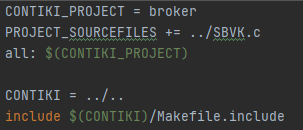

# Broker

The role of the broker is to manage the entry packets and answer is needed. It also transfers all packets
received by publishers to all subscribers which are subscribed. The broker is the gateway in the RPL
network, so all packets pass through by it.

## How it works

- Create a new Z1 node. Compile the broker.c on this node. 
  Pay attention for the makefile, it should be look like this: 

- Create some other Z1 nodes compiled with sensor C code (all codes available in sensor file).
- When you start, the broker can now communicate with all nodes. It can receive and send packets.
- It can also manage packets to add some subscribers to specific topics. 

# Utilization

Usage of C code and compiled into contiki on a Z1 mote.

# Development

We implement our protocol in the broker as a header file called "SBVK.h" to use all functions developed in the "SBVK.c" file. 

